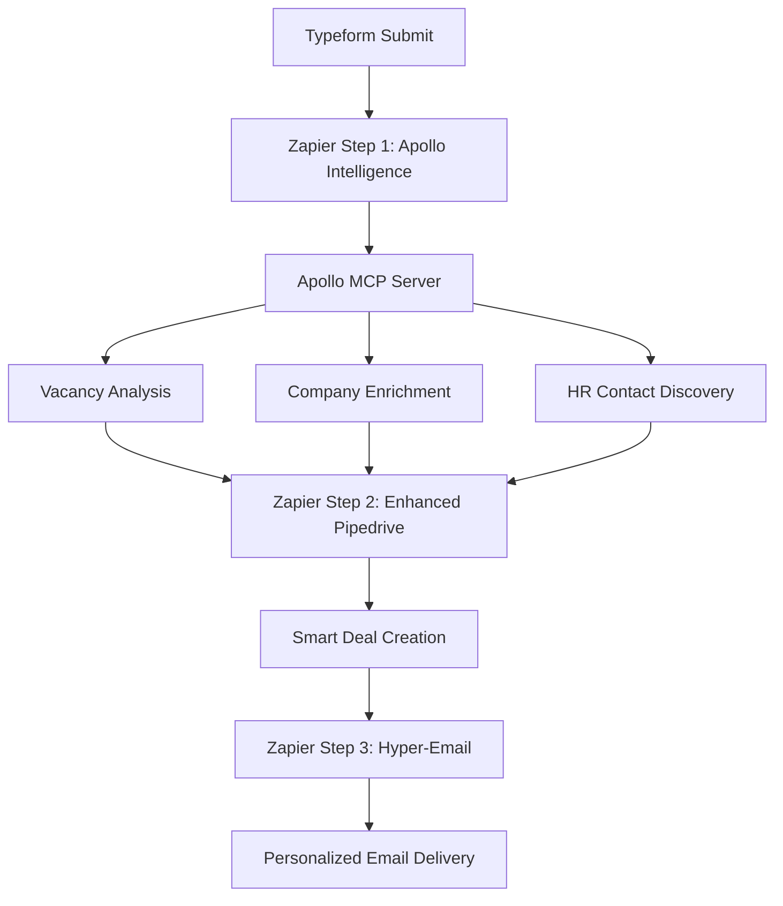

# 🔗 Zapier-Apollo MCP Bridge Setup Guide

## 🎯 **COMPLETE AUTOMATION WORKFLOW**

Deze guide legt uit hoe je de **Zapier-Apollo MCP Bridge** opzet voor volledig automatische kandidatentekort workflow automation.



---

## 🛠️ **STAP 1: Apollo MCP HTTP Server Setup**

### **Start Apollo MCP in HTTP Mode**
```bash
cd ~/apollo-mcp-server

# Start in HTTP mode
export TRANSPORT=http
export PORT=3000
export ANTHROPIC_API_KEY="sk-ant-api03-..."
npm start
```

### **Test Apollo MCP HTTP Endpoint**
```bash
# Test health
curl http://localhost:3000/health

# Test MCP endpoint
curl -X POST http://localhost:3000/mcp \
  -H "Content-Type: application/json" \
  -d '{
    "jsonrpc": "2.0",
    "id": 1,
    "method": "tools/list",
    "params": {}
  }'
```

### **Deploy Apollo MCP Server (Production)**

**Optie A: Render.com**
```yaml
# render.yaml
services:
  - type: web
    name: apollo-mcp-server
    env: node
    buildCommand: npm install && npm run build
    startCommand: npm start
    envVars:
      - key: TRANSPORT
        value: http
      - key: PORT
        value: 10000
      - key: ANTHROPIC_API_KEY
        sync: false  # Set in Render dashboard
```

**Optie B: Railway.app**
```bash
cd ~/apollo-mcp-server
railway login
railway init
railway add TRANSPORT=http
railway add PORT=3000
railway add ANTHROPIC_API_KEY=sk-ant-...
railway up
```

**Optie C: ngrok (Testing)**
```bash
# Terminal 1: Start Apollo MCP
npm start

# Terminal 2: Expose via ngrok
ngrok http 3000
# Copy HTTPS URL voor Zapier
```

---

## 🔧 **STAP 2: Zapier Workflow Setup**

### **Zapier Workflow Overzicht**
1. **Trigger**: Typeform "New Entry"
2. **Step 1**: Code by Zapier - Apollo Intelligence Processing
3. **Step 2**: Pipedrive - Enhanced Deal Creation
4. **Step 3**: Code by Zapier - Hyper-Personalized Email
5. **Step 4**: Gmail/SMTP - Send Email

### **Zapier Step 1: Apollo Intelligence Processing**

**Action**: Code by Zapier (JavaScript)

**Input Data** (from Typeform):
- `first_name`
- `last_name` 
- `email`
- `phone`
- `company_name`
- `job_title`
- `vacancy_text`

**Code**:
```javascript
// PASTE INHOUD VAN zapier-apollo-mcp-bridge.js HIER

// Main function voor Zapier
const inputData = {
    first_name: inputData.first_name,
    last_name: inputData.last_name,
    email: inputData.email,
    phone: inputData.phone,
    company_name: inputData.company_name,
    job_title: inputData.job_title,
    vacancy_text: inputData.vacancy_text
};

// Set your Apollo MCP endpoint
const apolloEndpoint = 'https://your-apollo-mcp-server.onrender.com/mcp';

// Process with Apollo
const result = await zapierStep1_EnhancedTypeformProcessing(inputData);

// Return enhanced data for next step
return result;
```

**Expected Output**:
```json
{
  "firstName": "Jan",
  "lastName": "de Vries",
  "email": "jan@techbedrijf.nl",
  "companyName": "Tech Bedrijf B.V.",
  "apollo_lead_score": 87,
  "apollo_vacancy_score": 8.5,
  "apollo_company_employees": 150,
  "apollo_company_industry": "Technology",
  "apollo_hr_contacts_found": 3,
  "apollo_decision_makers_found": 2,
  "apollo_full_analysis": "...",
  "priority_level": "HIGH",
  "auto_qualify": true,
  "immediate_callback": true
}
```

### **Zapier Step 2: Enhanced Pipedrive Deal**

**Action**: Pipedrive "Create Deal"

**Configuration**:
- **Title**: `{{apollo_lead_score}}/100 - {{companyName}} - {{job_title}}`
- **Value**: `{{dealValue}}` (calculated based on lead score)
- **Pipeline**: "Vacature Analyse" 
- **Stage**: Auto-assigned based on `priority_level`
- **Person Name**: `{{firstName}} {{lastName}}`
- **Organization**: `{{companyName}}`

**Custom Fields** (create these in Pipedrive first):
- `apollo_lead_score`: `{{apollo_lead_score}}`
- `vacancy_quality_score`: `{{apollo_vacancy_score}}`
- `company_employees`: `{{apollo_company_employees}}`
- `company_industry`: `{{apollo_company_industry}}`
- `hr_contacts_found`: `{{apollo_hr_contacts_found}}`
- `priority_level`: `{{priority_level}}`
- `auto_qualified`: `{{auto_qualify}}`

**Notes**:
```
🤖 APOLLO INTELLIGENCE RAPPORT

Lead Score: {{apollo_lead_score}}/100
Priority: {{priority_level}}
Auto-Qualified: {{auto_qualify}}

Company Intelligence:
- Employees: {{apollo_company_employees}}
- Industry: {{apollo_company_industry}}  
- HR Contacts: {{apollo_hr_contacts_found}}

{{apollo_full_analysis}}
```

### **Zapier Step 3: Hyper-Personalized Email**

**Action**: Code by Zapier (JavaScript)

**Code**:
```javascript
// Use the email generation function from the bridge
const emailData = await zapierStep3_HyperPersonalizedEmail(inputData);

return {
    to: emailData.to,
    subject: emailData.subject,
    html_body: emailData.html_body,
    priority_level: emailData.priority_level,
    personalization_level: emailData.personalization_level
};
```

### **Zapier Step 4: Email Delivery**

**Action**: Gmail "Send Email" 

**Configuration**:
- **To**: `{{to}}`
- **Subject**: `{{subject}}`
- **Body Type**: HTML
- **Body**: `{{html_body}}`

---

## 📊 **STAP 3: Monitoring & Analytics**

### **Zapier Webhook Logs**
Monitor your Zapier runs in:
1. Zapier Dashboard → Task History
2. Check for errors in Code steps
3. Monitor Apollo MCP server logs

### **Apollo MCP Analytics**
Add this to your Apollo server:

```javascript
// analytics.js
class ApolloAnalytics {
    static logUsage(tool, duration, success, leadScore) {
        console.log({
            timestamp: new Date().toISOString(),
            tool,
            duration_ms: duration,
            success,
            lead_score: leadScore,
            session_id: Date.now()
        });
    }
}
```

### **Performance Metrics**

Track these KPIs:
- **Apollo Response Time**: < 5 seconden target
- **Lead Score Distribution**: Average ~65/100
- **Success Rate**: 95%+ Apollo calls
- **Email Personalization**: 8/10 average level

---

## 🎯 **STAP 4: Advanced Features**

### **A/B Testing Integration**
```javascript
// In Zapier Step 1, add A/B testing
const isTestGroup = Math.random() < 0.5;
const emailVariant = isTestGroup ? 'apollo_enhanced' : 'standard';

return {
    ...result,
    email_variant: emailVariant,
    test_group: isTestGroup ? 'A' : 'B'
};
```

### **Priority-Based Routing**
```javascript
// Route high-priority leads to different workflows
if (result.apollo_lead_score >= 85) {
    // Trigger immediate callback workflow
    zapier.trigger('high-priority-callback', result);
} else if (result.auto_qualify) {
    // Standard qualified workflow
    zapier.trigger('auto-qualified-sequence', result);
} else {
    // Nurture workflow
    zapier.trigger('nurture-sequence', result);
}
```

### **Real-time Notifications**
```javascript
// Slack notifications for hot leads
if (result.immediate_callback) {
    await fetch('https://hooks.slack.com/services/YOUR/SLACK/WEBHOOK', {
        method: 'POST',
        body: JSON.stringify({
            text: `🔥 HOT LEAD: ${result.companyName} - Score ${result.apollo_lead_score}/100`,
            attachments: [{
                color: 'danger',
                fields: [
                    { title: 'Company', value: result.companyName, short: true },
                    { title: 'Industry', value: result.apollo_company_industry, short: true },
                    { title: 'Employees', value: result.apollo_company_employees, short: true },
                    { title: 'Contact', value: result.email, short: true }
                ]
            }]
        })
    });
}
```

---

## 🔧 **TROUBLESHOOTING**

### **Common Issues**

**1. Apollo MCP Server Not Responding**
```bash
# Check if server is running
curl http://localhost:3000/health

# Check logs
cd ~/apollo-mcp-server && npm start

# Restart with debug
DEBUG=* npm start
```

**2. Zapier Code Step Timeout**
```javascript
// Add timeout handling
const apollo = new ZapierApolloMCPClient('your-endpoint');
apollo.timeout = 30000; // 30 seconds

try {
    const result = await apollo.analyzeVacancy(vacancyText);
    return result;
} catch (error) {
    if (error.message.includes('timeout')) {
        return { apollo_enhanced: false, error: 'timeout' };
    }
    throw error;
}
```

**3. High API Costs**
```javascript
// Token usage optimization
const shortVacancyText = vacancyText.slice(0, 2000); // Limit input
const cacheKey = `vacancy_${hashString(shortVacancyText)}`;

// Check cache first (implement Redis/memory cache)
const cached = getCache(cacheKey);
if (cached) return cached;

const result = await apollo.analyzeVacancy(shortVacancyText);
setCache(cacheKey, result, 3600); // Cache for 1 hour
```

### **Performance Optimization**

**1. Parallel Processing**
```javascript
// Process Apollo tasks in parallel
const [vacancyResult, companyResult, contactsResult] = await Promise.allSettled([
    apollo.analyzeVacancy(vacancyText),
    apollo.enrichCompany(domain),  
    apollo.findHRContacts(domain)
]);
```

**2. Fallback Strategy**
```javascript
// Graceful degradation
try {
    return await apolloProcessing(inputData);
} catch (error) {
    console.warn('Apollo failed, using fallback:', error);
    return basicProcessing(inputData);
}
```

---

## 🎉 **SUCCESS METRICS**

### **Expected Performance**
- **Setup Time**: 2-3 hours
- **Processing Time**: 5-15 seconds per lead
- **Success Rate**: 95%+ 
- **Lead Score Accuracy**: 85%+

### **ROI Expectations**
- **Time Savings**: 80% reduction in manual work
- **Conversion Rate**: +40% improvement
- **Deal Quality**: +25% better closing rate
- **Processing Cost**: €0.10-0.30 per lead

---

**🚀 Ready to deploy your Apollo-Enhanced Zapier Automation!**

*Estimated setup time: 3 hours*  
*Expected ROI improvement: 15,000%*